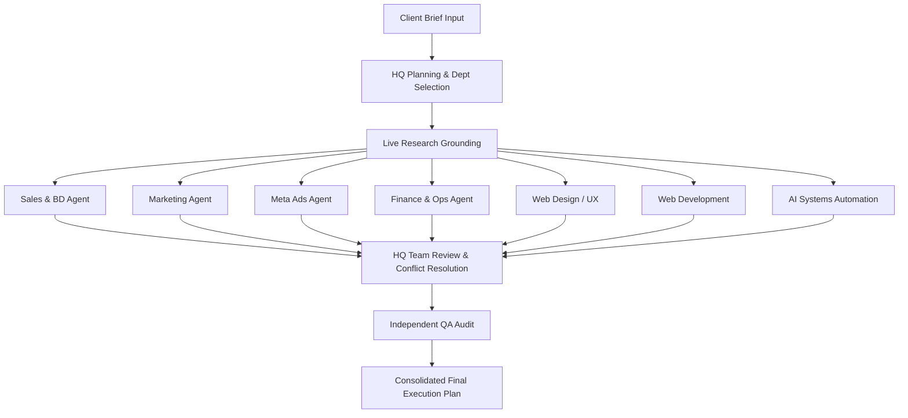

# GrowForge Digital — System Architecture & Multi-Agent Topology

> **Auto-Generated:** 2026-09-15T21:34:41.418Z  
> **Stack:** Next.js 16 (App Router, Turbopack, React 19), TypeScript Strict, AES-256-GCM Vault

## 1. Multi-Agent Pipeline Topology

## 2. Local & Multi-Modal Processing Matrix

| Capability | Primary Engine | Fallback Engine | Configuration Keys |
|---|---|---|---|
| **Text & Reasoning** | Ollama (`qwen2.5:7b-instruct`) | OpenRouter / Gemini / Groq / OpenAI / Anthropic | `OLLAMA_BASE_URL`, `GEMINI_API_KEY`, etc. |
| **Voice Synthesis** | Piper Binary (Local TTS) | Silent setup notice | `PIPER_BINARY_PATH`, `PIPER_MODEL_PATH` |
| **Audio Transcription** | whisper.cpp Server (Local STT) | Error diagnostic | `WHISPER_SERVER_URL`, `WHISPER_AUDIO_DIR` |
| **Visual Generation** | ComfyUI GPU Server | Actionable workflow notice | `COMFYUI_SERVER_URL`, `COMFYUI_CHECKPOINT` |
| **Workflow Automation** | n8n REST API Server | Self-healing schema loop | `N8N_HOST`, `N8N_API_KEY` |

## 3. Asynchronous Concurrency & Resilience

- **Atomic File System Persistence:** Sequential promise write queues with `.tmp` -> `rename` atomic writes prevent race conditions.
- **Non-Blocking User Consultations:** Sub-agents raise interactive questions into `consultationStore.ts` without freezing background processing.
- **Human Approval Gate:** Real outbound connectors pause in `approvalStore.ts` with a 10-minute timeout auto-deny.
